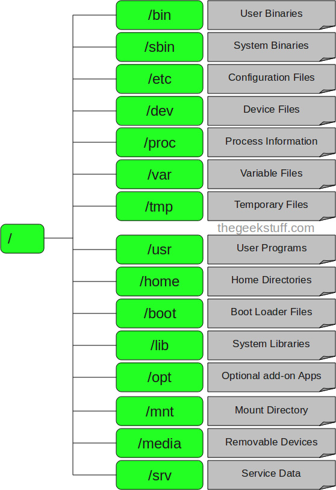

**1. / - Root (Thư mục gốc)**

- Mỗi một file và thư mục đều bắt đầu bằng thư mục root.
- Chỉ có Root mới có quyền ghi trong thư mục này.
- Chí có người dùng Root có quyền trên các thư mục ở cấp bên dưới.
- Lưu ý rằng thư mục /root là thư mục của người dùng root chứ không phải là thư mục `/`.

**2. /bin - User Binares (Các tập tin thực thi của người dùng)**
- Chứa các file thực thi dạng binary.
- Các lệnh sử dụng thông thường trong linux được sử dụng `single-user mode` được đặt dưới cấu tríc thư mục này.
- Các câu lệnh được sử dụng bởi tất cả user trong hệ thonogd sẽ được đặt trong đây.
```sh
Ex: một số lệnh như: ps, ls, ping, grep, cp...
```
**3. /sbin - System Binaries (Các tập tin thực thi của hệ thống)**
- Giống như `/bin`, bên trong `/sbin` cũng chứa đựng các file thực thi dạng binary. Các lệnh bên trong `/sbin` thường được sử dụng bởi `system administrator` và dùng cho các mục đích là duy trì quản trị hệ thống.
```sh
EX: iptables, reboot, ifconfig,fdisk, fsck.
```

**4. /etc - Configuration Files (Các taaoj tin cấu hình)**
- Chứa cấu hình các tập tin cấu hình của hệ thống, các tập tin lệnh để khởi động các dịch vụ của hệ thống..
- Ngoài ra, `/etc` còn chứa các shell script start, stop, kiểm tra status cho các chương trình.
```sh
EX: /etc/resolv.conf (Cấu hình DNS)
    /etc/network or etc/sysconfig/network-scripts
```

**5. /dev - Device Files (Các tập tin thiết bị)**
- Chứa các tập tin thiết bị để nhận biết các thiết bị của hệ thống.
- Bao gồm thiết bị đầu cuối, USB hoặc các thiết bị được gắn trên hệ thống.
```sh
Ex: /dev/tty1 hay /dev/sda
```

**6. /Proc - Process Information (thông tin tiến trình)**
- Chứa các tập tin về tiến trình của hệ thống.
- Các tập tin tại đây chứa thông tin về các tiến trình đang chạy.
```sh
Ex: `/proc/{pid} directory` : chứa thông tin đến tiến trình với `pid` đã chọn.
```
- Đây là một Virtual Filesystem chứa đựng các thông tin về tài nguyên của hệ thống.
Ví dụ như `/proc/cpuinfo` cung cấp cho ta thông số kỹ thuật của CPU.

**7. /var - Variable Files (Các tập tin biến đổi)**
- Chứa các tập tin mà dung lượng lớn dần theo thời gian sử  dụng.
- Bao gồm – Các tập tin ghi chú về hệ thống `(/var/log)`; các gói và các tập tin cơ sở dữ liệu `(/var/lib)`; thư điện tử `(/var/mail)`;  hàng đợi in queues (/var/spool); các tập tin khóa `(/var/lock)`; các tập tin tạm được dùng khi khởi động lại `(/var/tmp)`;

https://kb.hostvn.net/cau-truc-cay-thu-muc-trong-linux_61.html
http://thuviencntt.com/bai-viet-huong-dan/huong-dan-linux/cau-truc-thu-muc-tren-linux/
https://quantrimang.com/he-thong-tap-tin-va-thu-muc-tren-linux-45046
