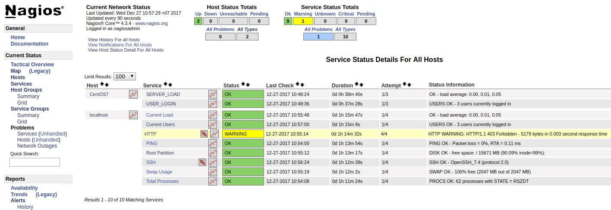
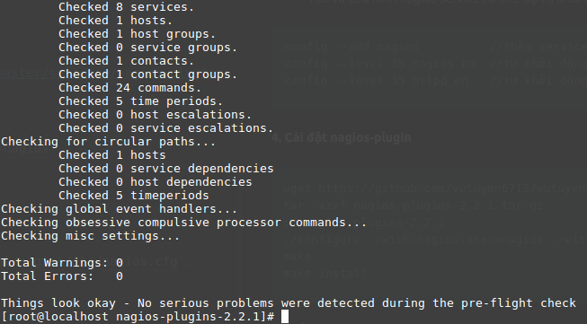
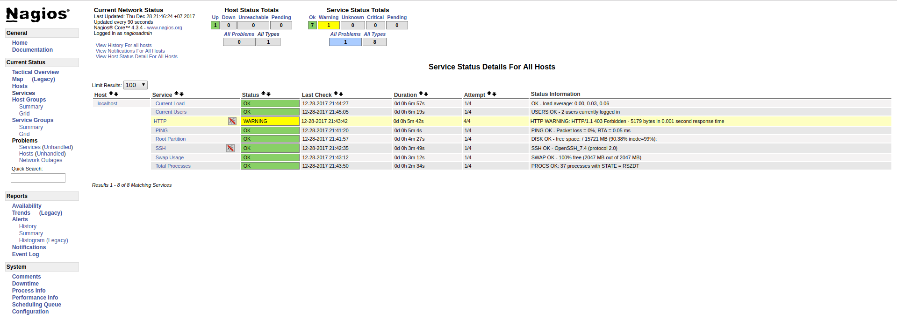

Phần mềm giám sát hệ thống **nagios core**  là phần mền open source ( không mất phí ), là 1 công cụ giám sát mạnh cho những kỹ sư làm về hệ thống, mạng máy tính. Ngoài ra còn có bản tính phí ( đã tích hợp những plugin, config sẵn cho người dùng sử dụng dễ dàng hơn )

**Chuẩn bị**
- hai máy Centos 7 minimal 64 bit:
  - 1 - Nagios Core với IP: 172.16.1.100
  - 2 - Nagios Client với IP: 172.16.1.101

**Install Nagios Core**

**1. Trước khi cài đặt nagios core bạn cần cài đặt những gói đi kèm như sau:**  

```sh
#yum install httpd php glibc glibc-common gd gd-devel make net-snmp wget
#yum groupinstall "Development Tools"
```

**2. Tạo user và group nagios bằng câu lệnh sau**

```sh
useradd nagios  
passwd nagios
groupadd nagcmd
usermod -a -G nagcmd nagios   //thêm user nagios vào group nagios (nagcmd)
usermod -a -G nagcmd apache   //thêm user apache vào group nagios (nagcmd)
```

**3. Install Nagios Core**

- Tiến hành downoad gói Nagios Core

```sh
wget https://github.com/vutuyen6712/vutuyen6712.github.io/raw/master/software/nagios-4.3.4.tar.gz
```

- Bước tiếp theo chúng ta sẽ biên dịch và cài đặt bằng câu lệnh

```sh
tar zxfv nagios-4.3.4.tar.gz
cd nagios-4.3.4
./configure --with-command-group=nagcmd
make all
make install
make install-init
make install-commandmode
make install-config
make install-webconf
```

- Sau đó chúng ta tạo file password.users để lưu username và password dùng để đăng nhập nagios trên nền web bằng câu lệnh sau:

```sh
htpasswd -c /usr/local/nagios/etc/htpasswd.users nagiosadmin  // password: nagiosadmin
```
- Tạo và cấu hình nagios services ở chế độ tự khởi động dịch vụ khi khởi động lại Nagios Server:

```sh
chkconfig --add nagios          //thêm service nagios
chkconfig --level 35 nagios on  //tự khởi động service nagios ở mode 3,5 trong inittab linux
chkconfig --level 35 httpd on   //tự khởi động service apache ở mode 3,5 trong inittab linux

```

**4. Cài đặt nagios-plugin**

```sh
wget https://github.com/vutuyen6712/vutuyen6712.github.io/raw/master/software/nagios-plugins-2.2.1.tar.gz
tar -xzvf nagios-plugins-2.2.1.tar.gz
cd nagios-plugins-2.2.1
./configure --with-nagios-user=nagios --with-nagios-group=nagios
make
make install
```

**5. Kiểm tra**
+  Kiểm tra trạng thái file cấu hình của nagios `/usr/local/nagios/etc/nagios.cfg`.
Nếu:  
      - Total Warnning = 0
      - Total Errors = 0

Có nghĩa file cấu hình của bạn ok, nếu có lỗi bạn xem lại file cấu hình và chỉnh sửa lại

```sh
/usr/local/nagios/bin/nagios -v /usr/local/nagios/etc/nagios.cfg
```


- Khởi động lại apache.
```sh
systemctl restart httpd.service
systemctl enable httpd.service
```

*Note*
- Để kiểm tra xem Apache or Nagios hoạt động hay chưa

```sh
systemctl status httpd.service
systemctl status nagios.service
```
- Nếu Apache or Nagios chưa hoạt động thì sử dụng lệnh sau để bật nó lên.

```sh
systemctl start httpd.service
systemctl start nagios.service
```
- Đăng nhập vào nagios web interface bằng địa chỉ http://172.16.1.100/nagios

  ( user: nagiosadmin / password: nagiosadmin)



<a href="https://github.com/vutuyen6712/LearnEnglish/blob/master/Unit%202/unit2.md">Unit 2: Tổng quát về từ và câu (tiếp)</a>
