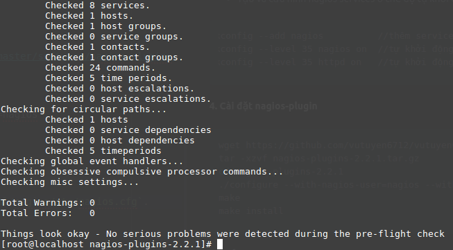

Thực hiện cài đặt NRPE trên Nagios Client (máy nguồn giám sát). Thông tin từ máy Nagios client sẽ được NRPE update lên Nagios Server.

- hai máy Centos 7 minimal 64 bit:
  - 1 - Nagios Core với IP: 172.16.1.100
  - 2 - Nagios Client với IP: 172.16.1.101

**I. Thực hiện trên Nagios Client 172.16.1.101**

**1. Đầu tiên cài đặt các gói cần thiết trước khi cài NRPE**
```sh
yum install wget gcc glibc glibc-common openssl*
useradd -m nagios
passwd nagios  
```  

**2. Cài đặt Nagios-plugin**

```sh
wget https://github.com/vutuyen6712/vutuyen6712.github.io/raw/master/software/nagios-plugins-2.2.1.tar.gz
tar -xzvf nagios-plugins-2.2.1.tar.gz
cd nagios-plugins-2.2.1
./configure --with-nagios-user=nagios --with-nagios-group=nagios
make
make install
```

**3. Cài đặt NRPE**

```sh
wget https://github.com/vutuyen6712/vutuyen6712.github.io/raw/master/software/nrpe-2.15.tar.gz
tar -xzvf nrpe-2.15.tar.gz
cd nrpe-2.15
./configure --with-nrpe-user=nagios --with-nrpe-group=nagios
make all
make install-plugin
make install-daemon
make install-daemon-config
```

**4. Cấu hình file NRPE Config**

- Thêm địa chỉ Nagios Server trong file `vi /usr/local/nagios/etc/nrpe.cfg`


**II. Cài đặt plugin check_nrpe thực hiện trên nagios server (172.16.1.100)**

**1. Download và cài đặt NRPE**

```sh
yum install gcc glibc glibc-common openssl*
wget https://github.com/itlabvn/share/raw/master/nrpe-2.15.tar.gz
tar -xzvf nrpe-2.15.tar.gz
cd nrpe-2.15
./configure --with-nrpe-user=nagios --with-nrpe-group=nagios
make all
make install-plugin
make install-daemon
make install-daemon-config
```

- Kiểm tra xem file check_nrpe có trong libexec chưa ?

```sh
ls /usr/local/nagios/libexec/check_nrpe

```

**2. Định nghĩa  các nagios client cần monitor**

`vi /usr/local/nagios/etc/nagios.cfg`

```sh
cfg_dir=/usr/local/nagios/etc/servers // bỏ comment dòng này trong file nagios.cfg
```
- Định nghĩa đối tượng cần monitor

`vi /usr/local/nagios/etc/servers/CentOS7.cfg`  ( có thể định nghĩa thêm các services cần monitor trong file `/usr/local/nagios/etc/nrpe.cfg`  trên nagios client & và file `/usr/local/nagios/etc/servers/CentOS7.cfg )`

```sh
mkdir -p /usr/local/nagios/etc/servers
cd /usr/local/nagios/etc/servers
vi CentOS7.cfg
```

```sh
define host {
      use linux-server
      host_name CentOS7
      alias CentOS7
      address 172.16.1.101  //địa chỉ Client
      contact_groups admins
}
define service {
      use generic-service
      host_name CentOS7
      contact_groups admins
      service_description SERVER_LOAD
      check_command  check_nrpe!check_load
}
define service {
      use generic-service
      host_name CentOS7
      contact_groups admins
      service_description USER_LOGIN
      check_command  check_nrpe!check_users
}

```
- Định nghĩa command check_nrpe trên file `/usr/local/nagios/etc/objects/commands.cfg`

```sh
define command {
        command_name check_nrpe
        command_line  $USER1$/check_nrpe -H $HOSTADDRESS$ -c $ARG1$
}
```
**Note**
```sh
$USER1$  = /usr/local/nagios/libexec
$HOSTADDRESS$  = IP nagios client
$ARG1$ = command check tren nrpe client (check_load,check_memory...)
```


- Kiểm tra file nagios config đúng chưa bằng câu lệnh
```sh
/usr/local/nagios/bin/nagios -v /usr/local/nagios/etc/nagios.cfg
```


- Vào nagios web interface kiểm tra http://172.16.1.100/nagios
