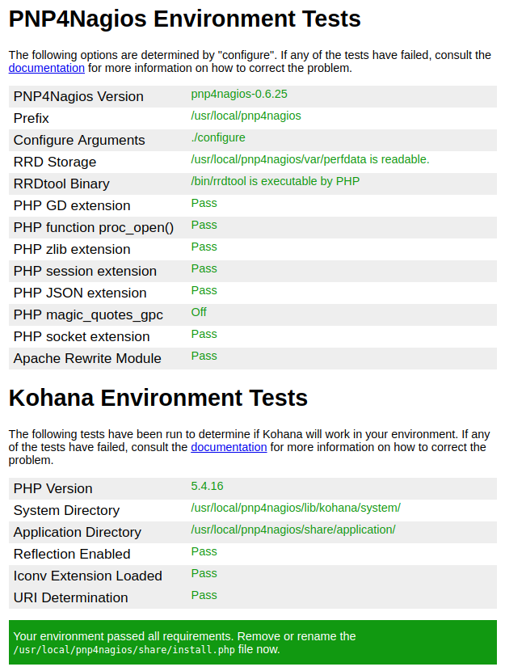
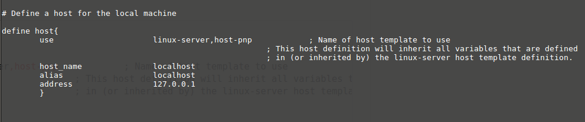
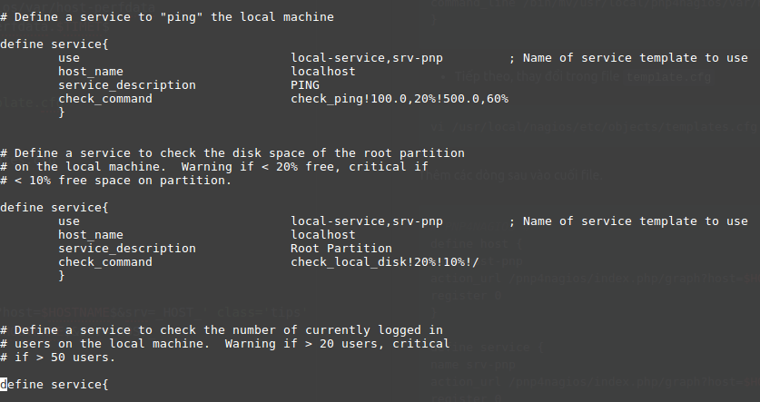
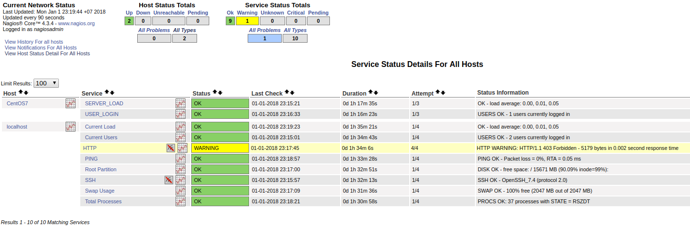

**1. Trước khi cài đặt nagios core bạn cần cài đặt những gói đi kèm như sau:**

```sh
yum install rrdtool perl-Time-HiRes rrdtool-perl php-gd
```

**2. Download - giải nén và cài đặt**

```sh
wget https://github.com/vutuyen6712/vutuyen6712.github.io/raw/master/software/pnp4nagios-0.6.25.tar.gz
tar zxfv pnp4nagios-0.6.25.tar.gz
cd pnp4nagios-0.6.25
./configure
make all
make fullinstall
chkconfig --add npcd && chkconfig --level 35 npcd on
systemctl restart httpd
```

- Sau khi hoàn tất tiến hành truy cập địa chỉ `172.16.1.100/pnp4nagios`

Kết quả thu được:



**3. Đổi tên file `install.php` thành `install.php-bak`**

```sh
mv  /usr/local/pnp4nagios/share/install.php /usr/local/pnp4nagios/share/install.php-bak
```

**4. Thực hiện thay đổi trong file cấu hình Nagios tích hợp pnp4nagios để tạo ra đồ thị**

```sh
vi /usr/local/nagios/etc/nagios.cfg
```

- tiến hành sửa đổi `Process_performance_data=1` và thêm vào các dòng sau:

```sh
# Bulk / NPCD mode
process_performance_data=1   // sửa từ 0 thành 1
// thêm các dòng vào dưới process_performance_data=1

service_perfdata_file=/usr/local/pnp4nagios/var/service-perfdata
service_perfdata_file_template=DATATYPE::SERVICEPERFDATA\tTIMET::$TIMET$\tHOSTNAME::$HOSTNAME$\tSERVICEDESC::$SERVICEDESC$\tSERVICEPERFDATA::$SERVICEPERFDATA$\tSERVICECH$
service_perfdata_file_mode=a
service_perfdata_file_processing_interval=15
service_perfdata_file_processing_command=process-service-perfdata-file

host_perfdata_file=/usr/local/pnp4nagios/var/host-perfdata
host_perfdata_file_template=DATATYPE::HOSTPERFDATA\tTIMET::$TIMET$\tHOSTNAME::$HOSTNAME$\tHOSTPERFDATA::$HOSTPERFDATA$\tHOSTCHECKCOMMAND::$HOSTCHECKCOMMAND$\tHOSTSTATE::$
host_perfdata_file_mode=a
host_perfdata_file_processing_interval=15
host_perfdata_file_processing_command=process-host-perfdata-file
```

- Thay đổi trong file command.cfg
```sh
vi /usr/local/nagios/etc/objects/commands.cfg
```
  - đi đến cuối file và thực hiện chú thích `#` các dòng sau:

```sh
  # 'process-host-perfdata' command definition
#define command{
#       command_name    process-host-perfdata
#       command_line    /usr/bin/printf "%b" "$LASTHOSTCHECK$\t$HOSTNAME$\t$HOSTSTATE$\t$HOSTATTEMPT$\t$HOSTSTATETYPE$\t$HOSTEXECUTIONTIME$\t$HOSTOUTPUT$\t$HOSTPERFDATA$\n" >> /usr/local/nagios/var/host-perfdata.out
#       }


# 'process-service-perfdata' command definition
#define command{
#       command_name    process-service-perfdata
#       command_line    /usr/bin/printf "%b" "$LASTSERVICECHECK$\t$HOSTNAME$\t$SERVICEDESC$\t$SERVICESTATE$\t$SERVICEATTEMPT$\t$SERVICESTATETYPE$\t$SERVICEEXECUTIONTIME$\t$SERVICELATENCY$\t$SERVICEOUTPUT$\t$SERVICEPERFDATA$\n" >> /usr/local/nagios/var/service-perfdata.out
#       }
```

  - thêm vào cuối file các dòng sau:

```sh
# 'process-host-perfdata' command definition
define command{
command_name process-host-perfdata
command_line /usr/bin/printf "%b" "$LASTHOSTCHECK$\t$HOSTNAME$\t$HOSTSTATE$\t$HOSTATTEMPT$\t$HOSTSTATETYPE$\t$HOSTEXECUTIONTIME$\t$HOSTOUTPUT$\t$HOSTPERFDATA$$
}

# 'process-service-perfdata' command definition
define command{
command_name process-service-perfdata
command_line /usr/bin/printf "%b" "$LASTSERVICECHECK$\t$HOSTNAME$\t$SERVICEDESC$\t$SERVICESTATE$\t$SERVICEATTEMPT$\t$SERVICESTATETYPE$\t$SERVICEEXECUTIONTIME$$
}

define command{
command_name process-service-perfdata-file
command_line /bin/mv/usr/local/pnp4nagios/var/service-perfdata /usr/local/pnp4nagios/var/spool/service-perfdata.$TIMET$
}

define command{
command_name process-host-perfdata-file
command_line /bin/mv/usr/local/pnp4nagios/var/host-perfdata /usr/local/pnp4nagios/var/spool/host-perfdata.$TIMET$
}
```

- Tiếp theo, thay đổi trong file ` template.cfg`

```sh
vi /usr/local/nagios/etc/objects/templates.cfg
```
Thêm các dòng sau vào cuối file.

```sh
# PNP4NAGIOS #
define host {
name host-pnp
action_url /pnp4nagios/index.php/graph?host=$HOSTNAME$&srv=_HOST_' class='tips' rel='/pnp4nagios/index.php/popup?host=$HOSTNAME$&srv=_HOST_
register 0
}

define service {
name srv-pnp
action_url /pnp4nagios/index.php/graph?host=$HOSTNAME$&srv=$SERVICEDESC$' class='tips' rel='/pnp4nagios/index.php/popup?host=$HOSTNAME$&srv=$SERVICEDESC$
register 0
```

- Thay đổi trong file cấu hình

```sh
vi /usr/local/nagios/etc/objects/localhost.cfg
```
- Thêm `host-pnp` vào `define host`:



- Thêm `srv-pnp` vào các `define service`



- Tương tự trên file `/usr/local/nagios/etc/servers/CentOS7.cfg` ta cũng thêm `host-pnp` và `srv-pnp`
- Kiểm tra xem còn lỗi nào không
```sh
/usr/local/nagios/bin/nagios -v /usr/local/nagios/etc/nagios.cfg
```

**5. Khởi động lại dịch vụ httpd, Nagios và Npcd bằng lệnh dưới đây.**

```sh
systemctl restart httpd && systemctl restart nagios && systemctl restart npcd
```

**6. Kiểm tra kết quả**

- Truy cập địa chỉ: `172.16.1.100/nagios`


